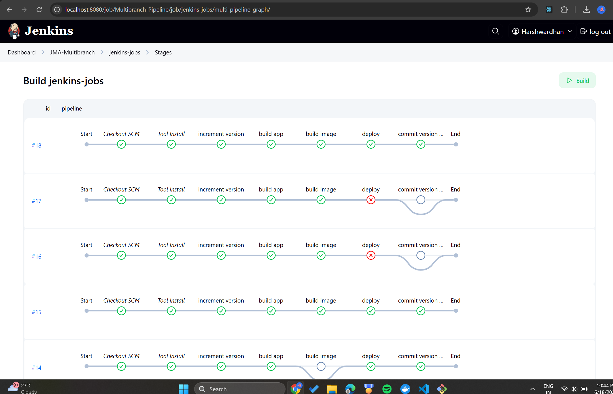

# Java Maven Application - Jenkins Docker AWS Pipeline 🚀

A complete CI/CD pipeline implementation using Jenkins, Docker, and AWS EC2 for a Spring Boot application.

## � Pipeline Success





## 📋 Project Overview

This project demonstrates a fully automated CI/CD pipeline that:
- Builds a Java Maven Spring Boot application
- Packages it as a Docker container
- Deploys it to AWS EC2 using Jenkins Pipeline

## �🌿 Branch Structure & Functionality

This repository maintains three specialized branches with distinct purposes:

### `main` Branch
- **Purpose**: Production-ready code and stable documentation
- **Contains**: 
  - Latest stable version of the application source code
  - Project documentation and setup guides
  - Asset files and screenshots
  - Core configuration files

### `jenkins-jobs` Branch ⭐ **YOU ARE HERE**
- **Purpose**: Active CI/CD pipeline execution and automation
- **Functionality**:
  - **Automated Version Management**: Increments Maven version numbers automatically (e.g., 1.1.0 → 1.1.1)
  - **Continuous Integration**: Builds Java Maven application and runs tests
  - **Docker Operations**: Builds Docker images and pushes to Docker Hub (`harshwardhan07/harshwardhan:1.1.4-20`)
  - **AWS EC2 Deployment**: Deploys containerized application to EC2 instance via SSH
  - **Auto-commit**: Commits version bumps back to jenkins-jobs branch automatically
  - **Pipeline Monitoring**: Tracks build history and deployment status

### `jenkins-shared-library` Branch
- **Purpose**: Reusable Jenkins pipeline functions
- **Contains**:
  - `vars/buildJar.groovy` - Maven build function
  - `vars/buildImage.groovy` - Docker build and push function with error handling
  - `vars/deployApp.groovy` - Deployment function
  - Shared pipeline utilities and common functions

### Pipeline Workflow
```
jenkins-jobs branch → Jenkins Pipeline → Docker Hub → AWS EC2
       ↓                     ↓              ↓          ↓
Version increment    Build & Test    Push Image   Deploy App
Auto-commit         Use shared lib   Registry     Live service
```

**Key Features of jenkins-jobs branch**:
- ✅ Fully automated CI/CD pipeline with 5 stages
- ✅ Automatic version incrementation and Git commits
- ✅ Docker image building with permission handling
- ✅ AWS EC2 deployment with SSH automation
- ✅ Enhanced error handling and troubleshooting
- ✅ Integration with shared library functions

## �️ Architecture

```
GitHub Repository → Jenkins Pipeline → Docker Build → AWS EC2 Deployment
```

## 🛠️ Technologies Used

- **Backend**: Java 8, Spring Boot 2.3.5
- **Build Tool**: Maven
- **CI/CD**: Jenkins Pipeline (Declarative)
- **Containerization**: Docker
- **Cloud**: AWS EC2
- **Version Control**: Git/GitHub

## 🚀 Getting Started

### Prerequisites

- Java 8+
- Maven 3.6+
- Jenkins with required plugins
- Docker
- AWS EC2 instance
- GitHub repository access

1. **Clone the repository**
   ```bash
   git clone https://github.com/HarshwardhanPatil07/JMA-jenkins-docker-AWS.git
   cd JMA-jenkins-docker-AWS
   ```

## 📋 Project Overview

This project demonstrates a fully automated CI/CD pipeline that:
- Builds a Java Maven Spring Boot application
- Packages it as a Docker container
- Deploys it to AWS EC2 using Jenkins Pipeline

## 🏗️ Architecture

```
GitHub Repository → Jenkins Pipeline → Docker Build → AWS EC2 Deployment
```

## 🛠️ Technologies Used

- **Backend**: Java 8, Spring Boot 2.3.5
- **Build Tool**: Maven
- **CI/CD**: Jenkins Pipeline (Declarative)
- **Containerization**: Docker
- **Cloud**: AWS EC2
- **Version Control**: Git/GitHub


## 🚀 Getting Started

### Prerequisites

- Java 8+
- Maven 3.6+
- Jenkins with required plugins
- Docker
- AWS EC2 instance
- GitHub repository access

1. **Clone the repository**
   ```bash
   git clone https://github.com/HarshwardhanPatil07/JMA-jenkins-docker-AWS.git
   cd JMA-jenkins-docker-AWS
   ```

## 🔧 Complete Setup Guide

### 1. Initial Project Setup

#### Branch Management
```bash
# Clone and create branches
git clone https://github.com/HarshwardhanPatil07/JMA-jenkins-docker-AWS.git
cd JMA-jenkins-docker-AWS

# Create jenkins-jobs branch
git checkout -b jenkins-jobs
git push origin jenkins-jobs

# Create jenkins-shared-library branch  
git checkout -b jenkins-shared-library
git push origin jenkins-shared-library

# Switch between branches
git checkout main           # Switch to main
git checkout jenkins-jobs   # Switch to CI/CD branch
git checkout -             # Switch to previous branch
```

#### Shared Library Setup
```bash
# Switch to shared library branch
git checkout jenkins-shared-library

# Create shared library structure
mkdir vars
# Create function files:
# - vars/buildJar.groovy
# - vars/buildImage.groovy  
# - vars/deployApp.groovy

git add vars/
git commit -m "Create Jenkins shared library structure"
git push origin jenkins-shared-library
```

### 2. Jenkins Configuration

#### Install Required Tools
In Jenkins **Manage Jenkins** → **Global Tool Configuration**:

1. **Maven Installation**
   - Name: `maven-3.9` 
   - Installation: Automatic from Apache

2. **JDK Installation**
   - Name: `jdk17`
   - Installation: Automatic from Eclipse Adoptium

3. **SonarQube Scanner** (if using)
   - Name: `sonar-scanner`
   - Installation: Automatic

#### Configure Global Pipeline Library
**Manage Jenkins** → **Configure System** → **Global Pipeline Libraries**:

- **Name**: `jenkins-shared-library`
- **Default version**: `jenkins-shared-library`
- **Retrieval method**: Modern SCM
- **Source Code Management**: Git
- **Project Repository**: `https://github.com/HarshwardhanPatil07/JMA-jenkins-docker-AWS.git`
- **Credentials**: Select your GitHub credentials
- **Behaviors**: Add "Discover branches" → Pattern: `jenkins-shared-library`

#### Required Credentials Setup

**Manage Jenkins** → **Credentials** → **System** → **Global credentials**:

1. **GitHub Personal Access Token**
   - **ID**: `github-credentials`
   - **Type**: Username with password
   - **Username**: Your GitHub username
   - **Password**: GitHub Personal Access Token
   - **⚠️ Important**: PAT expires every 30-90 days - update regularly!

2. **Docker Hub Credentials**
   - **ID**: `73b703cb-6da5-46be-b448-5954f154defe`
   - **Type**: Username with password  
   - **Username**: Your Docker Hub username
   - **Password**: Docker Hub password/token

3. **EC2 SSH Key**
   - **ID**: `ec2-server-key`
   - **Type**: SSH Username with private key
   - **Username**: `ec2-user`
   - **Private Key**: Content of your EC2 .pem file

### 3. Jenkins Pipeline Configuration

#### Create Multibranch Pipeline
1. **New Item** → **Multibranch Pipeline**
2. **Branch Sources** → **Git**
   - **Project Repository**: `https://github.com/HarshwardhanPatil07/JMA-jenkins-docker-AWS.git`
   - **Credentials**: Select GitHub credentials
   - **Behaviors**: 
     - Discover branches: All branches
     - Discover pull requests from forks: None

#### Pipeline Execution
- Pipeline will automatically detect `Jenkinsfile` in `jenkins-jobs` branch
- Builds will run on the `jenkins-jobs` branch
- Version updates committed back to `jenkins-jobs` branch

### 4. Docker Setup

#### On Windows (Development)
```powershell
# Check Docker service
Get-Service -Name "*docker*"

# Start Docker Desktop (GUI application)
# Or start service (if Docker Desktop installed)
Start-Service -Name "com.docker.service"

# Verify Docker
docker --version
docker run hello-world
```

#### On Jenkins Server (Linux)
```bash
# Install Docker
sudo apt-get update
sudo apt-get install -y docker.io

# Add jenkins user to docker group
sudo usermod -aG docker jenkins

# Start Docker service
sudo systemctl start docker
sudo systemctl enable docker

# Verify installation
docker --version
```

#### Jenkins with Docker (Container setup)
```bash
# Run Jenkins with Docker socket mounted
docker run -p 8080:8080 -p 50000:50000 \
  -v /var/run/docker.sock:/var/run/docker.sock \
  -v jenkins_home:/var/jenkins_home \
  jenkins/jenkins:lts

# Or install Docker inside Jenkins container
docker exec -it -u root jenkins_container bash
apt-get update && apt-get install -y docker.io
usermod -aG docker jenkins
```

### 5. AWS EC2 Setup

#### EC2 Instance Configuration
1. **Launch EC2 instance** (Amazon Linux 2)
2. **Configure Security Group**:
   - SSH (22): Your IP
   - HTTP (80): 0.0.0.0/0
   - Custom (8080): 0.0.0.0/0 (for application)

#### Install Docker on EC2
```bash
# Connect to EC2
ssh -i your-key.pem ec2-user@your-ec2-ip

# Install Docker
sudo yum update -y
sudo yum install -y docker
sudo systemctl start docker
sudo systemctl enable docker
sudo usermod -aG docker ec2-user

# Install docker-compose
sudo curl -L "https://github.com/docker/compose/releases/download/v2.24.1/docker-compose-$(uname -s)-$(uname -m)" -o /usr/local/bin/docker-compose
sudo chmod +x /usr/local/bin/docker-compose
sudo ln -s /usr/local/bin/docker-compose /usr/bin/docker-compose

# Logout and login again for group changes
exit
ssh -i your-key.pem ec2-user@your-ec2-ip

# Verify installations
docker --version
docker-compose --version
```

### 6. Troubleshooting Common Issues

#### 🔴 Maven Tool Error
**Error**: `Tool type "maven" does not have an install of "Maven" configured`

**Solution**: Update Jenkinsfile tools section:
```groovy
tools {
    maven 'maven-3.9'  // Use exact name from Global Tool Configuration
    jdk 'jdk17'
}
```

#### 🔴 Docker Not Found Error  
**Error**: `docker: not found`

**Solutions**:
1. **Install Docker** on Jenkins agent
2. **Pipeline already handles this** - Docker build stage will be skipped if Docker unavailable
3. **Check Docker service**: `sudo systemctl status docker`

#### 🔴 Docker Daemon Not Running
**Error**: `Cannot connect to the Docker daemon at unix:///var/run/docker.sock. Is the docker daemon running?`

**Solutions**:
1. **Check Docker daemon status**:
   ```bash
   sudo systemctl status docker
   ```

2. **Start Docker daemon**:
   ```bash
   sudo systemctl start docker
   sudo systemctl enable docker  # Auto-start on boot
   ```

3. **Add Jenkins user to Docker group**:
   ```bash
   sudo usermod -aG docker jenkins
   # Restart Jenkins service after this
   sudo systemctl restart jenkins
   ```

4. **Manual Docker socket permissions** (if needed):
   ```bash
   sudo chmod 666 /var/run/docker.sock
   ```

5. **Verify Docker is working**:
   ```bash
   docker version
   docker run hello-world
   ```

**Note**: The shared library now automatically attempts to start Docker daemon if it's stopped.

#### 🔴 GitHub Authentication Failed
**Error**: `Authentication failed for 'https://github.com/...'`

**Solutions**:
1. **Update Personal Access Token** in Jenkins credentials
2. **Check PAT permissions**: repo, workflow, admin:repo_hook
3. **Verify credentials ID** matches Jenkinsfile: `github-credentials`

#### 🔴 Shared Library Not Found
**Error**: `Library jenkins-shared-library expected to contain at least one of src or vars directories`

**Solution**:
1. Ensure `vars/` directory exists in `jenkins-shared-library` branch
2. Check Global Pipeline Library configuration
3. Verify branch name: `jenkins-shared-library`

#### 🔴 EC2 Connection Issues
**Error**: SSH connection failed or `Host key verification failed`

**Solutions**:
1. **Check Security Group**: Allow SSH (port 22) from Jenkins IP
2. **Verify EC2 IP**: Update IP in Jenkinsfile if changed (currently: `54.237.251.57`)
3. **Test SSH manually**: `ssh -i key.pem ec2-user@ip`
4. **Check credentials**: Ensure `ec2-server-key` credential exists
5. **Host key issue**: Pipeline uses `-o StrictHostKeyChecking=no` to bypass

#### 🔴 Docker Image Registry Issues
**Error**: `pull access denied` or `repository does not exist`

**Solutions**:
1. **Verify image name consistency**: Pipeline now uses dynamic naming `harshwardhan07/harshwardhan:1.1.4-20`
2. **Check Docker Hub credentials**: Ensure `73b703cb-6da5-46be-b448-5954f154defe` is configured
3. **Image push verification**: Check Docker Hub for latest pushed images
4. **Registry login**: Ensure Docker login succeeds in pipeline

#### 🔴 Version Increment Conflicts
**Error**: Git conflicts during version commit

**Solution**:
```bash
# Manual resolution on jenkins-jobs branch
git checkout jenkins-jobs
git pull origin jenkins-jobs
git merge main --strategy-option=theirs
git push origin jenkins-jobs
```

#### 🔴 Git Author Identity Issues
**Error**: `Please tell me who you are` or `unable to auto-detect email address`

**Solution**: Already fixed in pipeline with:
```groovy
sh 'git config user.email "harshwardhanpatil07@yahoo.com"'
sh 'git config user.name "HarshwardhanPatil07"'
```

### 7. Branch Maintenance

#### Syncing Branches
```bash
# Keep jenkins-jobs updated with main
git checkout jenkins-jobs
git merge main
git push origin jenkins-jobs

# Update shared library independently
git checkout jenkins-shared-library
# Make changes to vars/ functions
git add vars/
git commit -m "Update shared library functions"
git push origin jenkins-shared-library
```

#### Regular Maintenance Tasks
- **Monthly**: Update GitHub Personal Access Token
- **Weekly**: Merge main branch changes to jenkins-jobs
- **As needed**: Update EC2 IP addresses in Jenkinsfile
- **As needed**: Update Docker image tags and versions

### 8. Pipeline Monitoring

#### Success Indicators
- ✅ All pipeline stages pass
- ✅ Version number incremented in pom.xml (e.g., 1.1.3 → 1.1.4)
- ✅ Docker image pushed to registry (`harshwardhan07/harshwardhan:1.1.4-XX`)
- ✅ Application running on EC2:8080
- ✅ Git commit pushed to jenkins-jobs branch

#### Monitoring Commands
```bash
# Check application on EC2
curl http://54.237.251.57:8080

# Check Docker containers on EC2  
ssh ec2-user@54.237.251.57 "docker ps"

# Check latest Docker images on registry
docker search harshwardhan07/harshwardhan

# View recent pipeline builds
# Access via Jenkins UI: http://localhost:8080
```

## 🐳 Docker Deployment

The pipeline deploys the application using dynamic versioning:
```bash
# Dynamic image based on version and build number
docker-compose -f docker-compose.yaml up --detach
# Uses: harshwardhan07/harshwardhan:${IMAGE_NAME}
```

## 🔍 Troubleshooting

### Common Issues

1. **Credential Expiry**
   - GitHub PAT expires every 30-90 days
   - Update credentials in Jenkins: `Dashboard → Manage Jenkins → Credentials`

2. **EC2 Connection Issues**
   - Verify security group allows SSH (port 22)
   - Check EC2 instance public IP (currently: 54.237.251.57)
   - Ensure .pem file permissions are correct

3. **Docker Pull Issues**
   - Verify Docker image exists in registry with correct naming
   - Check network connectivity from EC2 to Docker Hub
   - Ensure image naming consistency between build and deploy

### Current Pipeline Status

#### Latest Successful Build Information:
- **Current EC2 IP**: `54.237.251.57`
- **Application Port**: `8080`
- **Docker Image Pattern**: `harshwardhan07/harshwardhan:1.1.X-XX`
- **Latest Assets**: Build #18 (see `asset/Successful-Pipeline-18.png`)

### Logs
Check the pipeline console output for detailed logs:
- Available in Jenkins job → Build History → Console Output
- Sample output available in `#18-Pipeline-Console-Output.txt`
